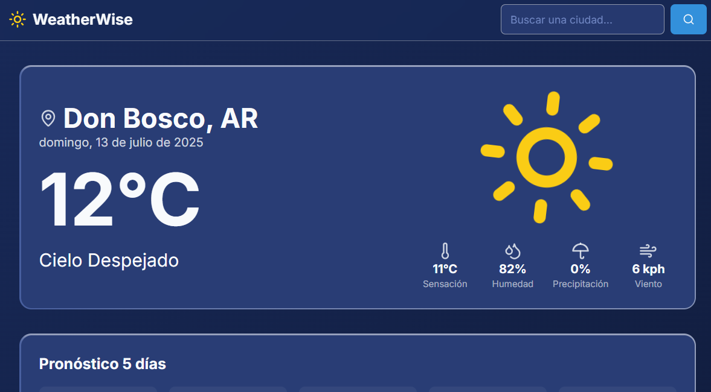

# WeatherWise - Pronóstico del Tiempo en Tiempo Real



**WeatherWise** es una aplicación web moderna y elegante que proporciona pronósticos del tiempo en tiempo real para cualquier ciudad del mundo. Construida con tecnologías de vanguardia, ofrece una experiencia de usuario rápida, receptiva e intuitiva.

La aplicación detecta automáticamente la ubicación del usuario para proporcionar un pronóstico local instantáneo y también permite buscar cualquier otra ciudad. La interfaz está diseñada para ser limpia e informativa, con iconos animados y un diseño futurista tipo "tarjeta de cristal" con bordes animados brillantes.

**Demo en Vivo:** [clima.clancig.com.ar](https://clima.clancig.com.ar)

---

## ✨ Características

- **Datos Meteorológicos en Tiempo Real:** Obtén información actualizada al minuto sobre temperatura, sensación térmica, humedad, velocidad del viento y probabilidad de precipitación.
- **Geolocalización:** Obtiene automáticamente el clima de tu ubicación actual al cargar la página.
- **Búsqueda de Ciudades con Autocompletado:** Encuentra fácilmente cualquier ciudad del mundo con una barra de búsqueda inteligente que ofrece sugerencias mientras escribes.
- **Pronóstico a 5 Días:** Planifica con antelación con un pronóstico detallado para los próximos cinco días. Al seleccionar un día, la tarjeta principal se actualiza con la información completa de esa fecha.
- **Pronóstico por Horas:** Visualiza el pronóstico para las próximas horas en un carrusel interactivo dentro de la tarjeta principal.
- **Diseño Receptivo:** Una interfaz totalmente receptiva que se ve genial en computadoras de escritorio, tabletas y dispositivos móviles.
- **Interfaz de Usuario Dinámica:** Incluye iconos meteorológicos animados y un moderno diseño de "tarjeta de cristal" con bordes iridiscentes.
- **Soporte Multilingüe:** Interfaz disponible en inglés, español y portugués, que se adapta al idioma del navegador.

---

## 🛠️ Tecnologías Utilizadas

Este proyecto está construido con un stack tecnológico moderno y listo para producción:

- **Framework:** [Next.js](https://nextjs.org/) (App Router)
- **Lenguaje:** [TypeScript](https://www.typescriptlang.org/)
- **Estilos:** [Tailwind CSS](https://tailwindcss.com/)
- **Componentes de UI:** [ShadCN UI](https://ui.shadcn.com/)
- **Lógica de Backend/IA (Opcional):** [Genkit de Google](https://firebase.google.com/docs/genkit)
- **Iconos:** [Lucide React](https://lucide.dev/guide/packages/lucide-react)

---

## 🔌 APIs

- **[API de Open-Meteo](https://open-meteo.com/):** Utilizada para obtener datos del tiempo actual y pronósticos a 5 días. ¡Es gratuita y no requiere API Key!

---

## 🚀 Cómo Empezar

Sigue estas instrucciones para obtener una copia local del proyecto y ponerla en funcionamiento.

### Prerrequisitos

- [Node.js](https://nodejs.org/) (versión 18.x o superior)
- [npm](https://www.npmjs.com/) o [yarn](https://yarnpkg.com/)

### Instalación

1.  **Clona el repositorio:**
    ```bash
    git clone https://github.com/damianclancig/weather-wise.git
    cd weather-wise
    ```

2.  **Instala las dependencias:**
    ```bash
    npm install
    ```

3.  **Configura las variables de entorno:**
    Crea un archivo llamado `.env.local` en la raíz de tu proyecto.

    ```.env.local
    APP_URL=http://localhost:3000
    ```

### Ejecutar la Aplicación

Para iniciar el servidor de desarrollo:

```bash
npm run dev
```

Abre [http://localhost:9002](http://localhost:9002) en tu navegador para ver el resultado.

---

## 📄 Licencia

Este proyecto se distribuye bajo la Licencia MIT. Consulta el archivo `LICENSE` para más información.

---

## 👨‍💻 Autor

- **Clancig** - [Sitio Web](https://clancig.com.ar) | [GitHub](https://github.com/damianclancig)
